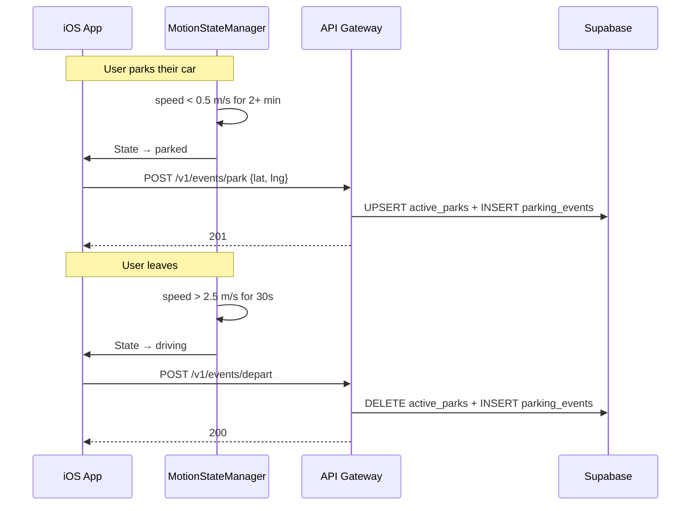
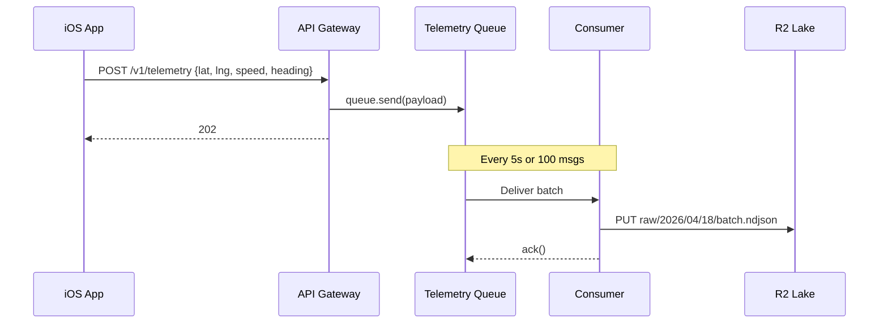
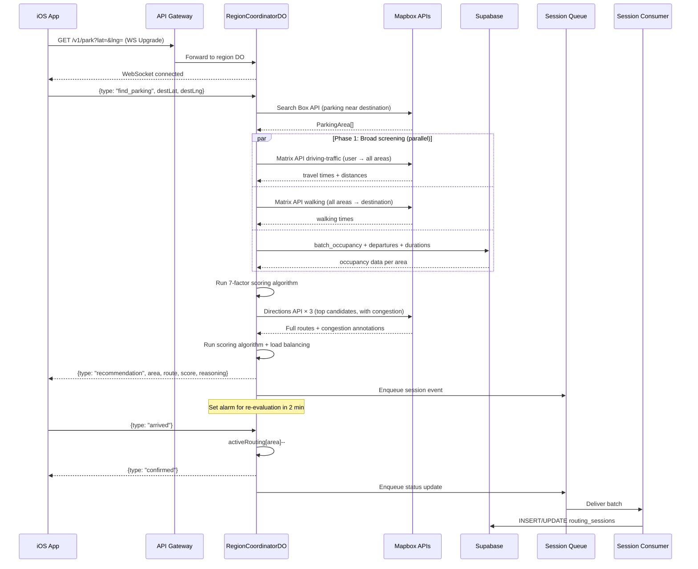

# Curby Backend — Revised Implementation Plan

## The Core Idea

Curby is **not** a parking inventory system. It's a **parking load balancer** — it uses crowdsourced occupancy data + Mapbox live traffic to distribute drivers across parking areas with the lowest congestion and highest probability of open spots.

**There is no pre-cataloged database of parking spots.** Instead:
1. Users passively contribute occupancy data by driving (the app detects park/depart events)
2. Mapbox provides the parking area locations + live traffic
3. An algorithm scores each area and routes the user to the best one
4. The system load-balances — if 10 users are already headed to Lot A, it steers the 11th to Lot B

---

## User Review Required

> [!IMPORTANT]
> **Supabase credentials (new key format)**: Supabase now uses `sb_publishable_*` and `sb_secret_*` keys (replacing the legacy `anon`/`service_role` JWTs). You'll need to set these as Cloudflare Worker secrets:
> - `SUPABASE_URL` — your project URL
> - `SUPABASE_SECRET_KEY` — an `sb_secret_*` key (backend only, bypasses RLS)
> - `SUPABASE_PUBLISHABLE_KEY` — an `sb_publishable_*` key (only if we ever need client-side Supabase calls)
>
> Generate these in Supabase Dashboard → Settings → API.

> [!IMPORTANT]
> **Mapbox APIs used**: Geocoding Search (find parking areas), Directions (routing + ETAs), Traffic (congestion data). You already have a Mapbox token in `Info.plist` — confirm it has access to these APIs.

> [!WARNING]
> **R2 bucket name**: `curby-telemetry-lake`. Speak up if you want something different.

---

## 1. How It Actually Works

### The Two Roles of Every User

Every Curby user is simultaneously a **data contributor** and a **parking seeker**:

```
┌─────────────────────────────────────────────────────────────────┐
│                        DATA CONTRIBUTOR                         │
│                                                                 │
│  Driving around → telemetry streams to R2 (archive)             │
│  Parked for 2+ min → app sends "I parked here" event           │
│  Starts driving again → app sends "I'm leaving" event          │
│                                                                 │
│  These events build the LIVE OCCUPANCY MAP                      │
└─────────────────────────────────────────────────────────────────┘

┌─────────────────────────────────────────────────────────────────┐
│                        PARKING SEEKER                           │
│                                                                 │
│  "Find me parking near [destination]"                           │
│  System queries Mapbox for parking areas                        │
│  System overlays crowdsourced occupancy data                    │
│  System checks live traffic conditions                          │
│  Algorithm scores + load-balances → best area picked            │
│  Route delivered via WebSocket → turn-by-turn navigation        │
└─────────────────────────────────────────────────────────────────┘
```

### Park/Depart Detection (Client-Side + Remote Config)

The iOS app already has `MotionStateManager` with speed thresholds and hysteresis. We extend it:

- **Park detected**: Speed stays below `speedStationary` for > `parkDetectionDurationSec` AND the location hasn't drifted > `parkDetectionDriftMeters` → the app POSTs a `park` event to the backend
- **Depart detected**: User was in `parked` state, speed exceeds `speedWalking` for > `departDetectionDurationSec` → the app POSTs a `depart` event

> [!IMPORTANT]
> **All detection thresholds are remotely configurable** via Cloudflare KV (see §3). The iOS app fetches the latest config on launch and periodically, so we can tune park detection sensitivity without pushing an app update.

This keeps detection lightweight and on-device — the backend just records events.

---

## 2. Supabase Database Schema

Much simpler than before. **3 tables** instead of 4. No `parking_spots` or `parking_zones`.

### Extensions

```sql
CREATE EXTENSION IF NOT EXISTS "postgis";
CREATE EXTENSION IF NOT EXISTS "uuid-ossp";
```

### Tables

#### `active_parks` — The Live Occupancy Map

Every currently-parked Curby user appears here. When they leave, their row is deleted. This table IS the crowdsourced occupancy data.

| Column | Type | Notes |
|--------|------|-------|
| `id` | `uuid` PK | Default `uuid_generate_v4()` |
| `user_id` | `uuid NOT NULL` | Device/user identifier |
| `location` | `geometry(Point, 4326) NOT NULL` | Where they parked |
| `geohash` | `text NOT NULL` | Geohash-encoded location (precision 7 ≈ 150m) for fast spatial bucketing |
| `parked_at` | `timestamptz NOT NULL` | When they parked |

**Usage**: When the algorithm wants to know how crowded an area is, it counts `active_parks` rows within a radius of the parking area. High density = area is likely full.

**Unique constraint**: One active park per user — `UNIQUE(user_id)`. If a user parks somewhere new without departing, the old record is replaced.

#### `parking_events` — Historical Log (Algorithm Training Data)

Immutable append-only log of every park/depart event. This is the data that lets the algorithm learn patterns: "Lot X fills up by 9am on weekdays", "Street parking on Main St opens up after 6pm."

| Column | Type | Notes |
|--------|------|-------|
| `id` | `bigint GENERATED ALWAYS AS IDENTITY` | |
| `user_id` | `uuid NOT NULL` | |
| `event_type` | `text NOT NULL` | `'parked'` or `'departed'` |
| `location` | `geometry(Point, 4326) NOT NULL` | |
| `geohash` | `text NOT NULL` | Same precision as `active_parks` |
| `recorded_at` | `timestamptz NOT NULL` | Client-side timestamp |
| `ingested_at` | `timestamptz NOT NULL DEFAULT now()` | |

> [!TIP]
> Partition `parking_events` by month (`PARTITION BY RANGE (ingested_at)`) for cheap retention management. Drop partitions older than 6 months.

#### `routing_sessions` — Recommendation Audit Log

Tracks every parking recommendation the system makes. Used for analytics, algorithm evaluation, and debugging.

| Column | Type | Notes |
|--------|------|-------|
| `id` | `uuid` PK | |
| `user_id` | `uuid NOT NULL` | |
| `destination` | `geometry(Point, 4326) NOT NULL` | Where the user wanted to go |
| `search_radius_m` | `integer NOT NULL` | How far we searched |
| `recommended_area` | `jsonb NOT NULL` | The parking area we recommended (Mapbox POI data + our score) |
| `alternatives` | `jsonb` | Other scored areas we considered |
| `route_geometry` | `jsonb` | Mapbox route polyline |
| `eta_seconds` | `integer` | Estimated travel time at recommendation |
| `score` | `real` | Algorithm score of the recommended area |
| `status` | `text NOT NULL` | `'active'`, `'arrived'`, `'cancelled'`, `'expired'` |
| `created_at` | `timestamptz DEFAULT now()` | |
| `resolved_at` | `timestamptz` | When status changed from `active` |

### Indexes

```sql
-- Spatial: the critical queries
CREATE INDEX idx_active_parks_location ON active_parks USING GIST (location);
CREATE INDEX idx_active_parks_geohash  ON active_parks (geohash);
CREATE INDEX idx_events_geohash_time   ON parking_events (geohash, ingested_at DESC);
CREATE INDEX idx_events_location       ON parking_events USING GIST (location);

-- Lookup
CREATE INDEX idx_active_parks_user     ON active_parks (user_id);
CREATE INDEX idx_sessions_user_status  ON routing_sessions (user_id, status);
```

### Key Database Functions

```sql
-- Count parked cars within a radius of a point (the core occupancy query)
CREATE OR REPLACE FUNCTION count_parked_nearby(
  lat double precision,
  lng double precision,
  radius_m integer DEFAULT 200
)
RETURNS bigint AS $$
  SELECT COUNT(*) FROM active_parks
  WHERE ST_DWithin(
    location::geography,
    ST_SetSRID(ST_MakePoint(lng, lat), 4326)::geography,
    radius_m
  );
$$ LANGUAGE sql STABLE;

-- Get occupancy density for multiple areas at once (batch query)
-- Input: array of {lat, lng} points + radius
-- Output: count per point
CREATE OR REPLACE FUNCTION batch_occupancy(
  points jsonb,  -- [{"lat": 40.7, "lng": -74.0}, ...]
  radius_m integer DEFAULT 200
)
RETURNS TABLE(idx integer, parked_count bigint) AS $$
  SELECT
    ordinality::integer - 1 AS idx,
    (SELECT COUNT(*) FROM active_parks
     WHERE ST_DWithin(
       location::geography,
       ST_SetSRID(ST_MakePoint(
         (point->>'lng')::double precision,
         (point->>'lat')::double precision
       ), 4326)::geography,
       radius_m
     )
    ) AS parked_count
  FROM jsonb_array_elements(points) WITH ORDINALITY AS t(point, ordinality);
$$ LANGUAGE sql STABLE;

-- Historical occupancy pattern for a geohash (for algorithm training)
CREATE OR REPLACE FUNCTION occupancy_pattern(
  target_geohash text,
  lookback_days integer DEFAULT 30
)
RETURNS TABLE(hour_of_day integer, day_of_week integer, avg_parked numeric, avg_departed numeric) AS $$
  SELECT
    EXTRACT(HOUR FROM recorded_at)::integer AS hour_of_day,
    EXTRACT(DOW FROM recorded_at)::integer AS day_of_week,
    COUNT(*) FILTER (WHERE event_type = 'parked')::numeric / GREATEST(lookback_days / 7, 1) AS avg_parked,
    COUNT(*) FILTER (WHERE event_type = 'departed')::numeric / GREATEST(lookback_days / 7, 1) AS avg_departed
  FROM parking_events
  WHERE geohash LIKE target_geohash || '%'
    AND ingested_at > now() - (lookback_days || ' days')::interval
  GROUP BY 1, 2
  ORDER BY 2, 1;
$$ LANGUAGE sql STABLE;
```

### Row-Level Security

- `active_parks`: Secret key writes. Public read (needed for map visualization eventually).
- `parking_events`: Secret key only.
- `routing_sessions`: Secret key writes. Public read filtered by `user_id`.

---

## 3. Remote Configuration (Cloudflare KV)

All tunable parameters — detection thresholds, algorithm weights, search radii — live in a **Cloudflare KV namespace** so they can be changed instantly without redeploying workers or pushing app updates.

### How It Works

1. A KV namespace `CURBY_CONFIG` stores a single JSON document under the key `app_config`
2. The API Gateway exposes `GET /v1/config` — the iOS app fetches this on launch and every 5 minutes
3. Workers/DOs read from KV when they need config values (with in-memory caching, ~60s TTL)
4. To change a value: update the JSON in Cloudflare Dashboard → KV → propagates globally in <60 seconds

### Config Schema

```typescript
interface CurbyRemoteConfig {
  version: number;  // Increment on every change — client caches by version

  // ── Park/Depart Detection (iOS reads these) ──
  detection: {
    parkDetectionDurationSec: number;    // Default: 120  (2 min stationary → parked)
    parkDetectionDriftMeters: number;    // Default: 20   (max GPS drift while "parked")
    departDetectionDurationSec: number;  // Default: 30   (30s of movement → departing)
    speedStationaryMs: number;           // Default: 0.5  (below this = stationary)
    speedWalkingMs: number;              // Default: 2.5  (above this = not parked)
  };

  // ── Algorithm Weights (DO reads these — see §4 for full math) ──
  algorithm: {
    weights: {
      availability: number;   // Default: 0.30  (w₁)
      turnover: number;       // Default: 0.10  (w₂)
      travelTime: number;     // Default: 0.20  (w₃)
      congestion: number;     // Default: 0.10  (w₄)
      walkDistance: number;   // Default: 0.15  (w₅)
      loadBalance: number;    // Default: 0.10  (w₆)
      confidence: number;     // Default: 0.05  (w₇)
    };
    estimatedCapacityPerArea: number;  // Default: 50  (K̂)
    recentDepartureWindowMin: number;  // Default: 15
    durationDecayHalfLifeHours: number; // Default: 4  (cars parked >4h less likely to leave)
    reEvaluationIntervalSec: number;   // Default: 120 (2 min)
    scoreUpdateThreshold: number;      // Default: 15 (min delta to push update)
    travelTimeDecayMin: number;        // Default: 10 (τ₀ in exponential decay)
    walkTimeDecayMin: number;          // Default: 8  (w₀ in exponential decay)
    loadPenaltyK: number;              // Default: 3  (steepness of logistic decay)
    confidenceMinUsers: number;        // Default: 10 (n₀ for confidence saturation)
  };

  // ── Search Parameters ──
  search: {
    defaultRadiusMeters: number;       // Default: 1000
    maxRadiusMeters: number;           // Default: 5000
    maxCandidates: number;             // Default: 10
    occupancyRadiusMeters: number;     // Default: 200  (radius for counting parked cars)
  };

  // ── Telemetry ──
  telemetry: {
    uploadIntervalSec: number;         // Default: 5    (how often app sends GPS)
    minDistanceMeters: number;         // Default: 10   (min movement to send update)
  };
}
```

### Default Config (seeded into KV)

```json
{
  "version": 1,
  "detection": {
    "parkDetectionDurationSec": 120,
    "parkDetectionDriftMeters": 20,
    "departDetectionDurationSec": 30,
    "speedStationaryMs": 0.5,
    "speedWalkingMs": 2.5
  },
  "algorithm": {
    "weights": {
      "availability": 0.30,
      "turnover": 0.10,
      "travelTime": 0.20,
      "congestion": 0.10,
      "walkDistance": 0.15,
      "loadBalance": 0.10,
      "confidence": 0.05
    },
    "estimatedCapacityPerArea": 50,
    "recentDepartureWindowMin": 15,
    "durationDecayHalfLifeHours": 4,
    "reEvaluationIntervalSec": 120,
    "scoreUpdateThreshold": 15,
    "travelTimeDecayMin": 10,
    "walkTimeDecayMin": 8,
    "loadPenaltyK": 3,
    "confidenceMinUsers": 10
  },
  "search": {
    "defaultRadiusMeters": 1000,
    "maxRadiusMeters": 5000,
    "maxCandidates": 10,
    "occupancyRadiusMeters": 200
  },
  "telemetry": {
    "uploadIntervalSec": 5,
    "minDistanceMeters": 10
  }
}
```

> [!TIP]
> **Updating config**: Go to Cloudflare Dashboard → Workers & Pages → KV → `curby-config` namespace → edit the `app_config` key. Changes propagate globally within 60 seconds. No redeploy needed.

---

## 4. The Algorithm — Mathematical Formulation

The parking load balancer runs **entirely in the backend** (inside the `RegionCoordinatorDO`). It takes all available data — Mapbox traffic, crowdsourced occupancy, routing load — and produces a single optimal recommendation. The user's phone receives only the final answer.

### 4A. Where It Runs & Data Sources

The `RegionCoordinatorDO` gathers data from **3 sources** before scoring:

| Source | What It Provides | API Call |
|--------|-----------------|----------|
| **Mapbox Search Box API** | Parking area locations near destination | `GET /search/searchbox/v1/category/parking` |
| **Mapbox Matrix API** | Driving time from user → each area (1×N, `driving-traffic` profile) | `GET /directions-matrix/v1/mapbox/driving-traffic/{coords}` |
| **Mapbox Matrix API** | Walking time from each area → destination (N×1, `walking` profile) | `GET /directions-matrix/v1/mapbox/walking/{coords}` |
| **Mapbox Directions API** | Full route geometry + per-segment congestion (top 3 candidates only) | `GET /directions/v5/mapbox/driving-traffic/{coords}?annotations=congestion_numeric` |
| **Supabase** | Parked car count + park durations near each area | `batch_occupancy()` + `batch_durations()` |
| **Supabase** | Recent departure count + rate per area | `batch_departures()` |
| **Supabase** | Historical occupancy patterns per geohash | `occupancy_pattern()` |
| **Durable Object** (in-memory) | Users currently being routed to each area | `activeRouting` map |

> [!TIP]
> **Mapbox API efficiency**: The Matrix API returns all travel times in a single call (1×N). We only call the more expensive Directions API (which returns full route geometry + congestion annotations) for the **top 3 scoring candidates** — not all of them. This keeps costs low.

### 4B. The Composite Score Formula

For each candidate parking area *i*, we compute a weighted composite score:

```
S(i) = w₁·f_avail(i) + w₂·f_turn(i) + w₃·f_travel(i) + w₄·f_congest(i) + w₅·f_walk(i) + w₆·f_load(i) + w₇·f_conf(i)
```

Where each `f` maps to **[0, 1]** (higher = better), and weights sum to 1.0:

| Factor | Symbol | Weight | What It Measures |
|--------|--------|--------|------------------|
| Availability | `f_avail` | w₁ = 0.30 | Probability of open spots based on occupancy |
| Turnover | `f_turn` | w₂ = 0.10 | Rate at which spots are opening up |
| Travel Time | `f_travel` | w₃ = 0.20 | How fast the user can drive there (Mapbox traffic-aware) |
| Congestion | `f_congest` | w₄ = 0.10 | Traffic congestion along the route + around the area |
| Walk Distance | `f_walk` | w₅ = 0.15 | Walking time from parking area to user's actual destination |
| Load Balance | `f_load` | w₆ = 0.10 | Penalty for areas we're already routing other users to |
| Data Confidence | `f_conf` | w₇ = 0.05 | How much crowdsourced data we have for this area |

> All 7 weights are **remotely tunable** via Cloudflare KV (§3). Change them in the dashboard → algorithm behaviour changes globally in <60 seconds.

### 4C. Factor Definitions (Full Math)

#### Factor 1: Availability — `f_avail(i)`

Estimates the probability that area *i* has at least one open spot when the user arrives.

**Inputs:**
- `n` = number of currently parked cars near area *i* (from `active_parks`, within `occupancyRadiusMeters`)
- `K̂` = estimated total capacity of the area (from remote config `estimatedCapacityPerArea`)
- `λ_d` = departure rate — departures per minute over the last `recentDepartureWindowMin` minutes
- `τ` = travel time in minutes from user to area *i* (from Mapbox Matrix)

**Formula:**

```
                 (K̂ - n) + λ_d · τ
f_avail(i) = ─────────────────────────
                       K̂
```

Clamped to [0, 1].

**Intuition**: Start with current vacancy `(K̂ - n)`, add the spots we expect to open up during the user's drive `(λ_d · τ)`, normalize by total capacity. If the area is half-full and spots are opening, availability is high. If it's packed and nobody's leaving, it's near zero.

```typescript
function fAvail(n: number, K: number, departureRate: number, travelMin: number): number {
  const expectedVacancy = (K - n) + departureRate * travelMin;
  return clamp(expectedVacancy / K, 0, 1);
}
```

---

#### Factor 2: Turnover — `f_turn(i)`

Measures how actively spots are opening up, weighted by how long current cars have been parked.

**Inputs:**
- `d_recent` = number of departures from this area in the last `recentDepartureWindowMin` minutes
- `W` = `recentDepartureWindowMin` (from remote config)
- `durations[]` = array of park durations (minutes) for each currently parked car near area *i*
- `t_half` = `durationDecayHalfLifeHours` × 60 (in minutes, from remote config)

**Formula:**

```
                 d_recent
λ_d = ────────────
                   W

                              1
P_leave(car_j) = ──────────────────────────
                  1 + (duration_j / t_half)²

                    Σⱼ P_leave(car_j)
f_turn(i) = min(1, ─────────────────── )
                          K̂ / 4
```

**Intuition**: Cars parked for a short time (< `t_half`) have high probability of leaving soon. Cars parked for 8+ hours (e.g. commuter lots) are unlikely to leave. We sum the leave-probabilities of all parked cars and normalize — a high sum means high turnover.

```typescript
function fTurnover(departures: number, windowMin: number, durations: number[], tHalfMin: number, K: number): number {
  // Departure rate
  const lambdaD = departures / windowMin;
  
  // Duration-weighted leave probability for each parked car
  const leaveProb = durations.reduce((sum, dur) => {
    return sum + 1 / (1 + (dur / tHalfMin) ** 2);
  }, 0);
  
  return clamp(leaveProb / (K / 4), 0, 1);
}
```

---

#### Factor 3: Travel Time — `f_travel(i)`

Prefers areas the user can reach quickly. Uses exponential decay so nearby areas score much higher than distant ones.

**Input:**
- `τ` = driving time in minutes from user to area *i* (from **Mapbox Matrix API**, `driving-traffic` profile)
- `τ₀` = `travelTimeDecayMin` (from remote config, default 10 min)

**Formula:**

```
f_travel(i) = e^(-τ / τ₀)
```

| Travel time | Score |
|-------------|-------|
| 0 min | 1.00 |
| 3 min | 0.74 |
| 5 min | 0.61 |
| 10 min | 0.37 |
| 15 min | 0.22 |
| 20 min | 0.14 |

```typescript
function fTravel(travelMinutes: number, decayMin: number): number {
  return Math.exp(-travelMinutes / decayMin);
}
```

---

#### Factor 4: Congestion — `f_congest(i)`

Penalizes areas where the driving route is heavily congested. Uses per-segment congestion from **Mapbox Directions API** (`congestion_numeric` annotation).

**Input:**
- `c[]` = array of `congestion_numeric` values along the route segments (0 = free flow, higher = worse)
- For candidates not yet scored with full Directions data, use a categorical estimate from Matrix travel time deviation

**Formula:**

```
                    Σₛ (distance_s × c_s)
c̄ = ────────────────────────────────
              Σₛ distance_s

f_congest(i) = max(0, 1 - c̄ / 100)
```

The weighted average congestion `c̄` is normalized by distance (longer segments count more). A fully free-flowing route scores 1.0, severe congestion scores near 0.

**Fallback** (when full Directions data isn't available yet — initial Matrix-based screening):

```
                           free_flow_time
f_congest_approx(i) = ─────────────────────
                         traffic_aware_time
```

If Mapbox Matrix says free-flow is 5 min but traffic-aware is 12 min, congestion ratio = 0.42 (heavily congested).

```typescript
function fCongestion(congestionNumeric: number[], segmentDistances: number[]): number {
  const totalDist = segmentDistances.reduce((a, b) => a + b, 0);
  const weightedCongestion = congestionNumeric.reduce(
    (sum, c, idx) => sum + c * segmentDistances[idx], 0
  ) / totalDist;
  return clamp(1 - weightedCongestion / 100, 0, 1);
}

// Fallback when only Matrix data is available
function fCongestionApprox(freeFlowSec: number, trafficAwareSec: number): number {
  return clamp(freeFlowSec / trafficAwareSec, 0, 1);
}
```

---

#### Factor 5: Walk Distance — `f_walk(i)`

The user doesn't just want to park — they want to park near their *destination*. This factor penalizes areas that are far to walk from.

**Input:**
- `w` = walking time in minutes from parking area *i* to the user's destination (from **Mapbox Matrix API**, `walking` profile)
- `w₀` = `walkTimeDecayMin` (from remote config, default 8 min)

**Formula:**

```
f_walk(i) = e^(-w / w₀)
```

| Walk time | Score |
|-----------|-------|
| 0 min | 1.00 |
| 2 min | 0.78 |
| 5 min | 0.54 |
| 8 min | 0.37 |
| 15 min | 0.15 |

```typescript
function fWalk(walkMinutes: number, decayMin: number): number {
  return Math.exp(-walkMinutes / decayMin);
}
```

---

#### Factor 6: Load Balance — `f_load(i)`

Prevents the system from sending all users to the same "best" area. Uses a logistic (sigmoid) penalty that kicks in sharply as routing load increases.

**Input:**
- `R` = number of users currently being routed to area *i* (from DO's in-memory `activeRouting` map)
- `k` = `loadPenaltyK` (steepness, from remote config, default 3)

**Formula:**

```
                    1
f_load(i) = ─────────────────
             1 + e^(R - k)
```

| Users routed | Score (k=3) |
|-------------|-------|
| 0 | 0.95 |
| 1 | 0.88 |
| 2 | 0.73 |
| 3 | 0.50 |
| 4 | 0.27 |
| 5 | 0.12 |
| 7 | 0.02 |

**Intuition**: With k=3, the first 2 users routed to an area barely affect the score. At 3 users, it drops to 50%. At 5+, the area is effectively blocked. This creates natural spread.

```typescript
function fLoad(routedUsers: number, k: number): number {
  return 1 / (1 + Math.exp(routedUsers - k));
}
```

---

#### Factor 7: Data Confidence — `f_conf(i)`

The algorithm can only be as good as its data. Areas with very few Curby users contributing data should have reduced confidence — we're less sure about our availability estimate.

**Input:**
- `u` = total unique Curby users who have parked/departed near area *i* in the last 24 hours (from `parking_events`)
- `n₀` = `confidenceMinUsers` (from remote config, default 10)

**Formula:**

```
                   u
f_conf(i) = ──────────────
              u + n₀
```

| Users contributing | Score (n₀=10) |
|-------------------|-------|
| 0 | 0.00 |
| 2 | 0.17 |
| 5 | 0.33 |
| 10 | 0.50 |
| 20 | 0.67 |
| 50 | 0.83 |
| 100+ | ~1.00 |

**Intuition**: With 0 users, confidence is 0 — we know nothing. With 50+ users, we're fairly confident. This prevents the algorithm from making bold claims about areas it has no data for.

```typescript
function fConfidence(recentUniqueUsers: number, minUsers: number): number {
  return recentUniqueUsers / (recentUniqueUsers + minUsers);
}
```

---

### 4D. Putting It All Together

```typescript
interface ScoredArea {
  areaId: string;
  score: number;           // 0-1, higher = better
  breakdown: {
    availability: number;
    turnover: number;
    travelTime: number;
    congestion: number;
    walkDistance: number;
    loadBalance: number;
    confidence: number;
  };
  reasoning: string;       // Human-readable explanation
}

function scoreAllAreas(
  candidates: ParkingCandidate[],
  activeRouting: Map<string, number>,
  config: CurbyRemoteConfig['algorithm']
): ScoredArea[] {
  const { weights } = config;

  return candidates.map(c => {
    const avail    = fAvail(c.occupancy.parkedCount, config.estimatedCapacityPerArea,
                           c.occupancy.departureRate, c.traffic.travelTimeMin);
    const turn     = fTurnover(c.occupancy.recentDepartures, config.recentDepartureWindowMin,
                               c.occupancy.parkDurations, config.durationDecayHalfLifeHours * 60,
                               config.estimatedCapacityPerArea);
    const travel   = fTravel(c.traffic.travelTimeMin, config.travelTimeDecayMin);
    const congest  = c.traffic.congestionNumeric
                       ? fCongestion(c.traffic.congestionNumeric, c.traffic.segmentDistances)
                       : fCongestionApprox(c.traffic.freeFlowSec, c.traffic.trafficAwareSec);
    const walk     = fWalk(c.traffic.walkTimeMin, config.walkTimeDecayMin);
    const load     = fLoad(activeRouting.get(c.area.id) ?? 0, config.loadPenaltyK);
    const conf     = fConfidence(c.occupancy.recentUniqueUsers, config.confidenceMinUsers);

    const score = 
      weights.availability * avail +
      weights.turnover     * turn +
      weights.travelTime   * travel +
      weights.congestion   * congest +
      weights.walkDistance  * walk +
      weights.loadBalance   * load +
      weights.confidence    * conf;

    return {
      areaId: c.area.id,
      score,
      breakdown: {
        availability: avail, turnover: turn, travelTime: travel,
        congestion: congest, walkDistance: walk, loadBalance: load, confidence: conf,
      },
      reasoning: buildReasoning(avail, turn, travel, congest, walk, load, conf, c),
    };
  }).sort((a, b) => b.score - a.score);
}
```

### 4E. Mapbox API Call Strategy

To minimize API calls and cost, we use a **two-phase approach**:

**Phase 1 — Broad screening (cheap):**
1. **Mapbox Search Box API**: `GET /search/searchbox/v1/category/parking?proximity={dest}&limit=15` → returns parking POIs near destination
2. **Mapbox Matrix API** (driving): `GET /directions-matrix/v1/mapbox/driving-traffic/{user};{area1};{area2};...?sources=0&annotations=duration,distance` → 1 call returns driving time from user to ALL areas
3. **Mapbox Matrix API** (walking): `GET /directions-matrix/v1/mapbox/walking/{area1};{area2};...;{dest}?destinations={last}&annotations=duration` → 1 call returns walking time from ALL areas to destination
4. **Supabase**: `batch_occupancy()` + `batch_departures()` + `batch_durations()` → 3 queries

Total: **4 API calls** regardless of how many parking areas exist.

**Phase 2 — Detailed routing (top 3 only):**
5. **Mapbox Directions API** (×3): Full route geometry + `congestion_numeric` annotation for the top 3 scored candidates only

Total phase 2: **3 API calls**.

**Grand total: 7 API calls per parking request**, regardless of area count.

### 4F. Suggestions for Improved Accuracy

> [!NOTE]
> These are enhancements I recommend adding in future versions to make the algorithm more accurate.

1. **Time-of-day historical patterns**: Use `occupancy_pattern()` DB function to weight the availability score by historical data (e.g. "this lot fills up by 9am on weekdays"). The data already exists in `parking_events` — it just needs to be incorporated into `f_avail` as a prior.

2. **Event-aware surge detection**: Integrate with event APIs (Ticketmaster, etc.) or build a simple surge detector — if departure rate suddenly drops to 0 and arrival rate spikes, an event is happening. Automatically expand search radius and increase load-balance weight during surges.

3. **User feedback loop**: After parking, ask users "Did you find a spot?" (yes/no). Use this to calibrate `estimatedCapacityPerArea` per area over time — the system learns each lot's true capacity.

4. **Street parking segments**: Instead of treating street parking as point POIs, model them as line segments along roads. Estimate capacity per block based on road length ÷ average vehicle length. This would require Mapbox road geometry data but would dramatically improve street parking accuracy.

---

## 5. Backend Monorepo Structure

```
backend/
├── package.json                       # pnpm workspace root
├── pnpm-workspace.yaml
├── tsconfig.base.json
│
├── supabase/
│   └── migrations/
│       └── 001_initial_schema.sql     # Schema from §2
│
├── packages/
│   └── shared/
│       ├── package.json
│       ├── tsconfig.json
│       └── src/
│           ├── types.ts               # All shared types (TelemetryPayload, WSProtocol, etc.)
│           ├── config.ts              # RemoteConfig type + default values + KV helpers
│           ├── algorithm.ts           # 7-factor scoring formula (§4) — full math
│           ├── mapbox.ts              # Mapbox API client (Search, Matrix, Directions)
│           ├── geohash.ts             # Geohash encode/decode utilities
│           ├── supabase.ts            # Supabase client factory (uses sb_secret_ key)
│           ├── validation.ts          # Zod schemas for all payloads
│           └── index.ts              
│
├── workers/
│   ├── api-gateway/                   # Edge API + WebSocket upgrade + Durable Object host
│   │   ├── wrangler.jsonc
│   │   ├── package.json
│   │   ├── tsconfig.json
│   │   └── src/
│   │       ├── index.ts               # Router
│   │       ├── routes/
│   │       │   ├── telemetry.ts       # POST /v1/telemetry → Queue
│   │       │   ├── events.ts          # POST /v1/events/park & /depart → Supabase
│   │       │   ├── config.ts          # GET /v1/config → KV remote config
│   │       │   └── websocket.ts       # GET /v1/ws → DO upgrade
│   │       └── durable-objects/
│   │           ├── RegionCoordinatorDO.ts   # The brain — load balancer + algorithm
│   │           └── types.ts
│   │
│   ├── telemetry-consumer/            # Queue → R2 archive
│   │   ├── wrangler.jsonc
│   │   ├── package.json
│   │   ├── tsconfig.json
│   │   └── src/
│   │       └── index.ts
│   │
│   └── session-consumer/             # Queue → routing_sessions persistence
│       ├── wrangler.jsonc
│       ├── package.json
│       ├── tsconfig.json
│       └── src/
│           └── index.ts
```

---

## 6. Detailed Component Design

### 6A. API Gateway Worker

#### [NEW] [wrangler.jsonc](file:///Users/mora/Desktop/Dev-mac/curby/backend/workers/api-gateway/wrangler.jsonc)

```jsonc
{
  "name": "curby-api",
  "main": "src/index.ts",
  "compatibility_date": "2026-04-18",
  "compatibility_flags": ["nodejs_compat"],

  "durable_objects": {
    "bindings": [
      { "name": "REGION_COORDINATOR", "class_name": "RegionCoordinatorDO" }
    ]
  },
  "migrations": [
    { "tag": "v1", "new_classes": ["RegionCoordinatorDO"] }
  ],

  "queues": {
    "producers": [
      { "binding": "TELEMETRY_QUEUE", "queue": "curby-telemetry" },
      { "binding": "SESSION_QUEUE", "queue": "curby-sessions" }
    ]
  },

  "r2_buckets": [
    { "binding": "TELEMETRY_LAKE", "bucket_name": "curby-telemetry-lake" }
  ],

  "kv_namespaces": [
    { "binding": "CURBY_CONFIG", "id": "<your-kv-namespace-id>" }
  ]

  // Secrets: SUPABASE_URL, SUPABASE_SECRET_KEY, MAPBOX_ACCESS_TOKEN
}
```

#### [NEW] [src/index.ts](file:///Users/mora/Desktop/Dev-mac/curby/backend/workers/api-gateway/src/index.ts) — Router

| Route | Method | Handler | Description |
|-------|--------|---------|-------------|
| `/v1/telemetry` | `POST` | `telemetry.ts` | Enqueue GPS data → `TELEMETRY_QUEUE` → `202` |
| `/v1/events/park` | `POST` | `events.ts` | Record park event → `active_parks` + `parking_events` |
| `/v1/events/depart` | `POST` | `events.ts` | Delete from `active_parks` + log to `parking_events` |
| `/v1/config` | `GET` | `config.ts` | Return remote config from KV (iOS app fetches this) |
| `/v1/park` | `GET` (WS upgrade) | `websocket.ts` | Open WebSocket → `RegionCoordinatorDO` |
| `/health` | `GET` | — | `200 OK` |

Re-exports `RegionCoordinatorDO` so Wrangler bundles it.

#### [NEW] [src/routes/config.ts](file:///Users/mora/Desktop/Dev-mac/curby/backend/workers/api-gateway/src/routes/config.ts)

**`GET /v1/config`**:
1. Read `app_config` from `env.CURBY_CONFIG` KV namespace
2. If not found, return hardcoded defaults (from `packages/shared/config.ts`)
3. Return JSON with `Cache-Control: max-age=60` (client caches for 1 min)
4. iOS app calls this on launch + every 5 minutes

**`GET /v1/config?version=N`** (optional):
- If client already has version N and it matches, return `304 Not Modified`
- Saves bandwidth on repeated polls

#### [NEW] [src/routes/telemetry.ts](file:///Users/mora/Desktop/Dev-mac/curby/backend/workers/api-gateway/src/routes/telemetry.ts)
1. Validate `TelemetryPayload` with Zod
2. `env.TELEMETRY_QUEUE.send(payload)`
3. Return `202 Accepted`

#### [NEW] [src/routes/events.ts](file:///Users/mora/Desktop/Dev-mac/curby/backend/workers/api-gateway/src/routes/events.ts)

**`POST /v1/events/park`**:
1. Validate `{ userId, lat, lng, timestamp }`
2. Compute geohash from lat/lng
3. Upsert into `active_parks` (replace old park if exists via `ON CONFLICT (user_id)`)
4. Insert into `parking_events` (`event_type: 'parked'`)
5. Return `201`

**`POST /v1/events/depart`**:
1. Validate `{ userId, timestamp }`
2. Lookup user's row in `active_parks` to get location
3. Delete from `active_parks`
4. Insert into `parking_events` (`event_type: 'departed'`, with the location from the deleted row)
5. Return `200`

> [!NOTE]
> Park/depart events are low-frequency (once per park/depart per user) — direct Supabase writes are fine here. No queue needed.

#### [NEW] [src/routes/websocket.ts](file:///Users/mora/Desktop/Dev-mac/curby/backend/workers/api-gateway/src/routes/websocket.ts)
1. Parse destination `lat`, `lng` from query params
2. Compute geohash of destination (precision 4 ≈ 20km — defines the DO region)
3. Get DO stub: `env.REGION_COORDINATOR.idFromName(regionGeohash)`
4. Forward the WebSocket upgrade request to the DO

---

### 6B. RegionCoordinatorDO — The Brain

This is where the magic happens. One instance per geographic region (~20km²). It coordinates all parking requests in its region.

#### [NEW] [RegionCoordinatorDO.ts](file:///Users/mora/Desktop/Dev-mac/curby/backend/workers/api-gateway/src/durable-objects/RegionCoordinatorDO.ts)

```typescript
class RegionCoordinatorDO extends DurableObject<Env>
```

**In-Memory State:**
```typescript
// How many users are currently being routed to each parking area
activeRouting: Map<areaId, number>

// Connected WebSocket sessions
sessions: Map<userId, {
  ws: WebSocket,
  destination: LatLng,
  recommendedArea?: string,
  status: 'searching' | 'routing' | 'arrived'
}>
```

**WebSocket Lifecycle (Hibernation API):**

| Method | Behaviour |
|--------|-----------|
| `fetch(request)` | Accept WebSocket via `ctx.acceptWebSocket(server)`. Attach `{ userId, destination }` via `serializeAttachment()`. Register session. |
| `webSocketMessage(ws, msg)` | Parse `WSCommand`. Dispatch to `handleFindParking` / `handleArrived` / `handleCancel`. |
| `webSocketClose(ws)` | Decrement `activeRouting` count for this user's recommended area. Clean up session. |
| `alarm()` | Periodic re-evaluation: push updated recommendations if traffic changed. |

**Core Flow — `handleFindParking(ws, userId, destination)`:**

```
0. Read remote config from KV (cached in-memory, refreshed every 60s)
   → Get search radius, algorithm weights, re-evaluation interval

── PHASE 1: BROAD SCREENING (4 API calls) ──

1. Mapbox Search Box API
   → GET /search/searchbox/v1/category/parking?proximity={dest}&limit=15
   → Returns parking areas near destination

2. In parallel:
   a. Mapbox Matrix API (driving-traffic): user → all areas
      → 1 call returns driving time + distance to every area
   b. Mapbox Matrix API (walking): all areas → destination
      → 1 call returns walking time from every area to destination
   c. Supabase:
      → batch_occupancy() → parked car count per area
      → batch_departures() → departure count + rate per area
      → batch_durations() → park durations per area
      → batch_confidence() → unique contributing users per area (24h)

3. Run 7-factor scoring algorithm (§4) on all candidates
   → Uses f_avail, f_turn, f_travel, f_congest (approx), f_walk, f_load, f_conf
   → All weights from remote config
   → Load balancing from activeRouting in-memory map

── PHASE 2: DETAILED ROUTING (3 API calls) ──

4. Take top 3 scored candidates
   → Mapbox Directions API (×3) with congestion_numeric annotation
   → Get full route geometry + per-segment congestion data
   → Re-score these 3 with precise f_congest (replaces approximation)

5. Pick top recommendation (highest re-scored candidate)

6. Update state:
   - activeRouting[areaId]++
   - sessions[userId].recommendedArea = areaId
   - sessions[userId].status = 'routing'

7. Send via WebSocket:
   {
     type: "recommendation",
     area: { name, center, category },
     route: { geometry, travelTime, distance, congestion },
     score: { total, breakdown (all 7 factors) },
     reasoning: "Low occupancy (est 60% free), 4 min drive, 2 min walk, light traffic"
   }

8. Enqueue to SESSION_QUEUE for persistence

9. Set alarm for config.algorithm.reEvaluationIntervalSec
   → re-evaluate with fresh Mapbox + Supabase data if conditions changed
```

**Re-evaluation (alarm):**
- Every `config.algorithm.reEvaluationIntervalSec` seconds while a user is actively routing
- Re-query Mapbox traffic + Supabase occupancy
- If a significantly better option appears (score delta > `config.algorithm.scoreUpdateThreshold`), push an update:
  ```json
  { "type": "route_update", "reason": "better_option_found", "newArea": {...}, "newRoute": {...} }
  ```
- User's app decides whether to switch (don't force mid-drive)

---

### 6C. Telemetry Consumer Worker

#### [NEW] [wrangler.jsonc](file:///Users/mora/Desktop/Dev-mac/curby/backend/workers/telemetry-consumer/wrangler.jsonc)
```jsonc
{
  "name": "curby-telemetry-consumer",
  "main": "src/index.ts",
  "compatibility_date": "2026-04-18",
  "compatibility_flags": ["nodejs_compat"],
  "queues": {
    "consumers": [{
      "queue": "curby-telemetry",
      "max_batch_size": 100,
      "max_batch_timeout": 5
    }]
  },
  "r2_buckets": [
    { "binding": "TELEMETRY_LAKE", "bucket_name": "curby-telemetry-lake" }
  ]
}
```

#### [NEW] [src/index.ts](file:///Users/mora/Desktop/Dev-mac/curby/backend/workers/telemetry-consumer/src/index.ts)

`queue()` handler:
1. Receive batch of `TelemetryPayload[]`
2. Serialize as NDJSON
3. `PUT` to R2: `raw/{YYYY}/{MM}/{DD}/{HH}:{mm}:{ss}-{batchId}.ndjson`
4. `ack()` all messages

**No Supabase write** — raw telemetry goes to R2 only. This keeps costs minimal. The occupancy data comes from the explicit park/depart events, not from mining telemetry server-side.

---

### 6D. Session Consumer Worker

#### [NEW] [wrangler.jsonc](file:///Users/mora/Desktop/Dev-mac/curby/backend/workers/session-consumer/wrangler.jsonc)
```jsonc
{
  "name": "curby-session-consumer",
  "main": "src/index.ts",
  "compatibility_date": "2026-04-18",
  "compatibility_flags": ["nodejs_compat"],
  "queues": {
    "consumers": [{
      "queue": "curby-sessions",
      "max_batch_size": 50,
      "max_batch_timeout": 3
    }]
  }
  // Secrets: SUPABASE_URL, SUPABASE_SECRET_KEY
}
```

#### [NEW] [src/index.ts](file:///Users/mora/Desktop/Dev-mac/curby/backend/workers/session-consumer/src/index.ts)

`queue()` handler:
1. Receive batch of `SessionEvent[]`
2. For `created` events → `INSERT INTO routing_sessions`
3. For `arrived`/`cancelled`/`expired` events → `UPDATE routing_sessions SET status = ..., resolved_at = now()`
4. `ack()` all

---

## 7. Data Flow Diagrams

### Flow 1: Occupancy Data Collection (Passive)



### Flow 2: Telemetry Archival (Background)



### Flow 3: Parking Request (The Load Balancer)



---

## 8. WebSocket Protocol

### Client → Server

| `type` | Fields | Description |
|--------|--------|-------------|
| `find_parking` | `destLat`, `destLng`, `radius?`, `spotType?` | Request a parking recommendation |
| `arrived` | `sessionId` | User arrived at recommended area |
| `cancel` | `sessionId` | User cancels, wants to stop routing |
| `accept_update` | `sessionId` | Accept a pushed route update |
| `reject_update` | `sessionId` | Stay on current route |
| `heartbeat` | — | Keep-alive |

### Server → Client

| `type` | Fields | Description |
|--------|--------|-------------|
| `recommendation` | `sessionId`, `area`, `route`, `score`, `reasoning` | Best parking area + route |
| `route_update` | `sessionId`, `newArea`, `newRoute`, `reason` | Better option found |
| `no_data` | `message` | Not enough crowdsourced data in this area yet |
| `error` | `code`, `message` | e.g. `MAPBOX_ERROR`, `INVALID_DESTINATION` |
| `heartbeat_ack` | — | Pong |

---

## 9. R2 Storage

**Bucket**: `curby-telemetry-lake`

**Key format**: `raw/{YYYY}/{MM}/{DD}/{HH}:{mm}:{ss}-{uuid}.ndjson`

**Content**: Newline-delimited JSON. Each line:
```json
{"userId":"abc","lat":40.7128,"lng":-74.0060,"speed":12.5,"heading":180,"accuracy":5.2,"ts":"2026-04-18T21:15:30Z"}
```

**Purpose**: Long-term archive. Zero egress fees. Can be queried later with DuckDB/BigQuery for analytics, ML training, urban planning insights.

---

## 10. Environment Variables & Secrets

| Secret | Workers | Description |
|--------|---------|-------------|
| `SUPABASE_URL` | api-gateway, session-consumer | Supabase project URL |
| `SUPABASE_SECRET_KEY` | api-gateway, session-consumer | `sb_secret_*` key — bypasses RLS, backend only |
| `MAPBOX_ACCESS_TOKEN` | api-gateway (DO uses it) | Search + Directions + Traffic |

| Binding (not secret) | Workers | Description |
|----------------------|---------|-------------|
| `CURBY_CONFIG` (KV) | api-gateway | Remote config namespace |
| `TELEMETRY_LAKE` (R2) | api-gateway, telemetry-consumer | Raw telemetry archive |
| `TELEMETRY_QUEUE` (Queue) | api-gateway → telemetry-consumer | Telemetry pipeline |
| `SESSION_QUEUE` (Queue) | api-gateway → session-consumer | Session event pipeline |
| `REGION_COORDINATOR` (DO) | api-gateway | Durable Object binding |

---

## 11. Build Order

| Step | What | Depends On |
|------|------|------------|
| 1 | Scaffold monorepo (root configs, workspace) | — |
| 2 | Write Supabase migration SQL | — |
| 3 | Build `packages/shared` (types, config, validation, algorithm, geohash) | — |
| 4 | Build API Gateway router + telemetry route + config route | 1, 3 |
| 5 | Build events routes (park/depart) | 4 |
| 6 | Build RegionCoordinatorDO (WebSocket + algorithm + Mapbox + config) | 3, 4 |
| 7 | Build telemetry consumer (Queue → R2) | 1, 3 |
| 8 | Build session consumer (Queue → Supabase) | 1, 3 |
| 9 | Seed remote config defaults into KV | 3 |
| 10 | Wire all wrangler configs, test locally | 4-9 |

---

## Open Questions

> [!NOTE]
> **Mapbox Search Box API coverage**: Mapbox's category search can return parking-related POIs. We should verify coverage in your target launch area. If Mapbox parking POI density is poor, we may need to supplement with Google Places API.

> [!NOTE]
> **userId**: For v1, `userId` is simply a device-generated UUID passed in request bodies. No auth layer — the app generates a stable UUID on first launch and sends it with every request.

---

## Verification Plan

### Automated Tests
- **Unit tests** (Vitest): Algorithm scoring with mock data, geohash encoding, Zod validation, WebSocket message parsing, config parsing
- **Integration tests** (Miniflare): Full WebSocket flow, Queue → R2 pipeline, park/depart event handling, config endpoint

### Local Development
```bash
cd backend && pnpm install && pnpm run dev
```

### Manual Verification
- `wscat` to connect to the WebSocket and simulate a parking request
- Verify R2 bucket contents in Cloudflare Dashboard
- Query Supabase to confirm `active_parks` and `routing_sessions` data
- Hit `GET /v1/config` and verify remote config values

---

## 12. After Backend Is Done — iOS Integration Checklist

These changes are **NOT** part of the backend build. They document what needs to happen in the iOS app (`/curby`) to connect to the backend once it's deployed.

### 12A. New: Remote Config Service

**File**: `curby/Core/RemoteConfigService.swift`

- Fetches `GET /v1/config` on app launch and every 5 minutes
- Caches the response locally (UserDefaults or file)
- Exposes typed properties matching the `CurbyRemoteConfig` schema
- Falls back to hardcoded defaults if network is unavailable
- Other services observe this for threshold values

### 12B. Update: MotionStateManager

**File**: `curby/Motion/MotionStateManager.swift`

Currently uses hardcoded `CurbyConstants` for speed thresholds. Changes needed:

- Read `speedStationary`, `speedWalking` from `RemoteConfigService.detection` instead of `CurbyConstants`
- Add `parked` state to `MotionState` enum (currently only: `stationary`, `walking`, `driving`)
- Add park detection logic:
  - When `stationary` for `config.detection.parkDetectionDurationSec` with drift < `config.detection.parkDetectionDriftMeters` → transition to `parked`
  - When `parked` and speed > `config.detection.speedWalkingMs` for `config.detection.departDetectionDurationSec` → transition to `driving` and fire depart event

### 12C. New: Backend API Client

**File**: `curby/Core/CurbyAPIClient.swift`

- Base URL configuration (dev vs prod Cloudflare Worker URL)
- `postTelemetry(location:speed:heading:accuracy:)` → `POST /v1/telemetry`
- `postParkEvent(location:)` → `POST /v1/events/park`
- `postDepartEvent()` → `POST /v1/events/depart`
- `fetchConfig()` → `GET /v1/config`
- `userId` header injection (device-generated UUID, persisted in Keychain)

### 12D. New: Telemetry Uploader

**File**: `curby/Location/TelemetryUploader.swift`

- Subscribes to `LocationService.currentLocation` changes
- Respects `config.telemetry.uploadIntervalSec` and `config.telemetry.minDistanceMeters`
- Batches and POSTs to `/v1/telemetry` at the configured rate
- Handles offline/retry gracefully

### 12E. New: WebSocket Manager

**File**: `curby/Core/ParkingWebSocketManager.swift`

- Manages WebSocket lifecycle to `GET /v1/park?lat=&lng=`
- Sends `find_parking`, `arrived`, `cancel` commands
- Receives `recommendation`, `route_update`, `error` events
- Handles disconnect/reconnect resilience (common while driving)
- Publishes state to UI via `@Observable`

### 12F. New: Parking Flow UI

**Files**: `curby/UI/ParkingSearchView.swift`, `curby/UI/ParkingRouteView.swift`

- Search view: user enters/selects destination → triggers WebSocket flow
- Route view: displays recommended parking area, route overlay on map, ETA
- Handles `route_update` pushes (show "Better spot found" prompt)
- Arrived confirmation button

### 12G. Update: CurbyConstants.swift

**File**: `curby/Core/Constants.swift`

- Keep hardcoded values as **fallback defaults** only
- All runtime behaviour reads from `RemoteConfigService` first
- Add backend URL constant:
  ```swift
  static let apiBaseURL = "https://curby-api.<your-subdomain>.workers.dev"
  ```

### 12H. Update: LocationService.swift

**File**: `curby/Location/LocationService.swift`

- Wire up `TelemetryUploader` to send location data to backend
- May need `allowsBackgroundLocationUpdates = true` for continuous telemetry while driving (requires background location capability in Xcode)

### Integration Priority Order

| Priority | Task | Reason |
|----------|------|--------|
| 1 | `RemoteConfigService` | Everything else depends on config values |
| 2 | `CurbyAPIClient` | Base networking layer |
| 3 | `TelemetryUploader` | Start collecting data immediately |
| 4 | `MotionStateManager` updates | Park/depart detection feeds occupancy map |
| 5 | `ParkingWebSocketManager` | Core parking flow |
| 6 | Parking UI | User-facing feature |
